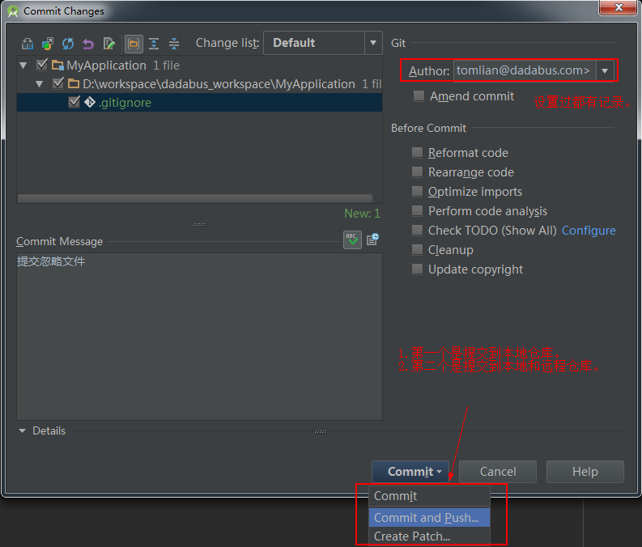
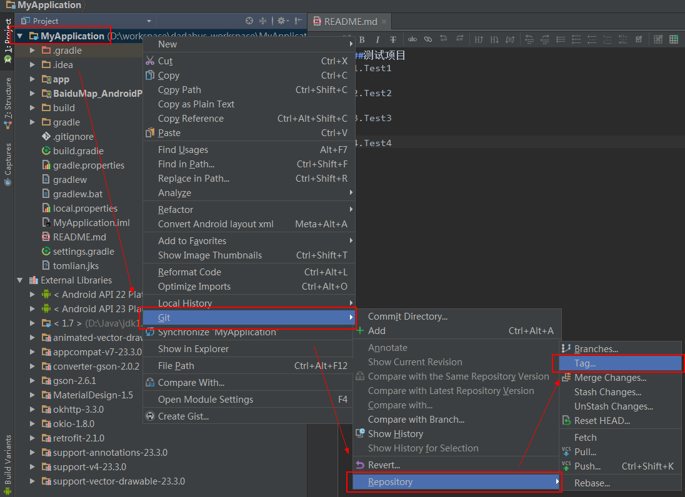

##GIT结合AS开发总结
		
	前言：
		没有前言的前言

	目录：
		一、初始化工程
		二、Pull & Push	
		三、Checkout & Reset
		四、Tag
		五、Branch（建设中）
		六、Merge
		七、常见的问题（持续更新中...）

	更新：
		1.	2016-07-04		TomLian		git总结第一版
		2.  2016-07-05		TomLian		修改【四、Tag】
										添加【五、Brach】
										添加【六、Merge】
		3.  2016-07-06		TomLian		修改【五、Brach】
		4.	2016-07-13		TomLian		修改【五、Brach】
		5.	2016-07-14		TomLian		修改【七、常见的问题】问题一	

* **一、初始化工程**

	* 方式一：命令来初始化工程相关代码.

	

	* 方式二：用Android Studio来创建git（重要）

		* 1.设置Version Control为git
		
		
		

		* 2.创建.gitignore

		####随意点击一个文件编辑，就会弹出这个提示，然后就是一直下一步。。。。
	
		
		
		####以下文件可以忽略，不然每次pull代码的时候，很烦人，为了避免不必要的纠纷，请一定要忽略！！！
		
		
		* 3.提交代码到远程仓库
	
		####Ctrl+K 提交代码
		
		####第一次提交到远程仓库，需要你填写URL。
		
		####提交到远程仓库显示的记录列表
		
		####提交成功会有提示push successful,然后你再查看log，orign/master是否为当前最新的位置。
		####初始化工程完成~	
		

	* 历史提交记录

		* HEAD：你当前代码所在的位置
		* master：本地仓库的主分支最新的记录
		* origin/master：远程仓库主分支最新的记录
		* 测试项目V2.0.0：即是当前tag的name，标记tag所在的位置

		
		

* **二、Pull & Push**

	* **Pull**

		####Merge和Rebase详解：https://git-scm.com/book/zh/ch3-6.html
		* Merge：使用这种方式update project，会显示分支合并到主分支的路线记录。
		* Rebase：使用这种方式update project，显示一条直线记录，看起来比较美观而已。
		* BranchDefault：如果你没有修改config，默认是merge方式update project。

		
	
	* **Push**

		参考：用Android Studio来创建git-->3.提交代码到远程仓库

* **三、Checkout & Reset**
	
	* **Checkout检出到指定位置**
		####Version control（alt+9）-->Log-->右键-->Checkout Revision

		

	* **Reset回退到指定位置**
		####本地仓库记录回退到某个指定版本
		* Mixed：代码不会回退，回退commit和index信息
		* Soft：代码不会回退，回退commit
		* Hard：代码也会回退，彻底回退。(此命令慎用)
		* Keep：	代码也会回退，彻底回退，但是本地改变的文件不会回退。

			
		####index信息
			
* **四、Tag**

	* 1.创建tag

		

		####Tag相关填写
		
		####Revision Number
		

	* 2.查看tag
		####AS查看
			Version Control-->Log查看
		####cmd或者git bash
			git tag（查看当前分支下的tag）
			git show [tag name](查看tag的所有信息)
		
	* 3.发布tag
		####push代码默认不会把tag提交到远程仓库，需要手动打勾选项（第一次才需要）
		
		####cmd方式
			git push origin v1.0.0（v1.0.0为tag name，push这个tag到远程仓库）
			git push origin --tags（push所以tag到远程仓库）

	* 4.删除tag

			git tag -d v1.0.0（删除tag）

* **五、Branch（分支）**
	
	* **1.创建分支**
	
		
	
	* **2.合并分支**
		####tomlian和tomlian1都是分支，master是主分支	
		
		####当前位置、本地分支、远程仓库分支。
		
		####合并分支的时候，必须checkout回到主分支，下图表示我当前位置在tomlian分支，所以需要回到master主分支。
		####Rebase的黄金法则：绝对不能把master主分支rebase到你的公共分支上！！！
		
		####然后选择你想要合并的分支，两种合并方式[Merge&Rebase](https://git-scm.com/book/zh/ch3-6.html)
		
* **六、Merge**
	
	####解决冲突的方式
	
	####合并冲突
	

* **七、常见的问题**

	* 问题一：因为没有commit过分支，所以找不到当前分支，只能回到主分支去update。

		

		####查看AS右下角，确定当前分支是否是主分支（master）
		

	* 问题二：找不到VersionControl提交历史记录

		####看图	
		
	

	* 问题三：打开项目发现右上角提示版本控制的错误，有可能就是没有添加version control路径

		####点击右边“加号”按钮，把项目路径添加到version control中就行。
		

	